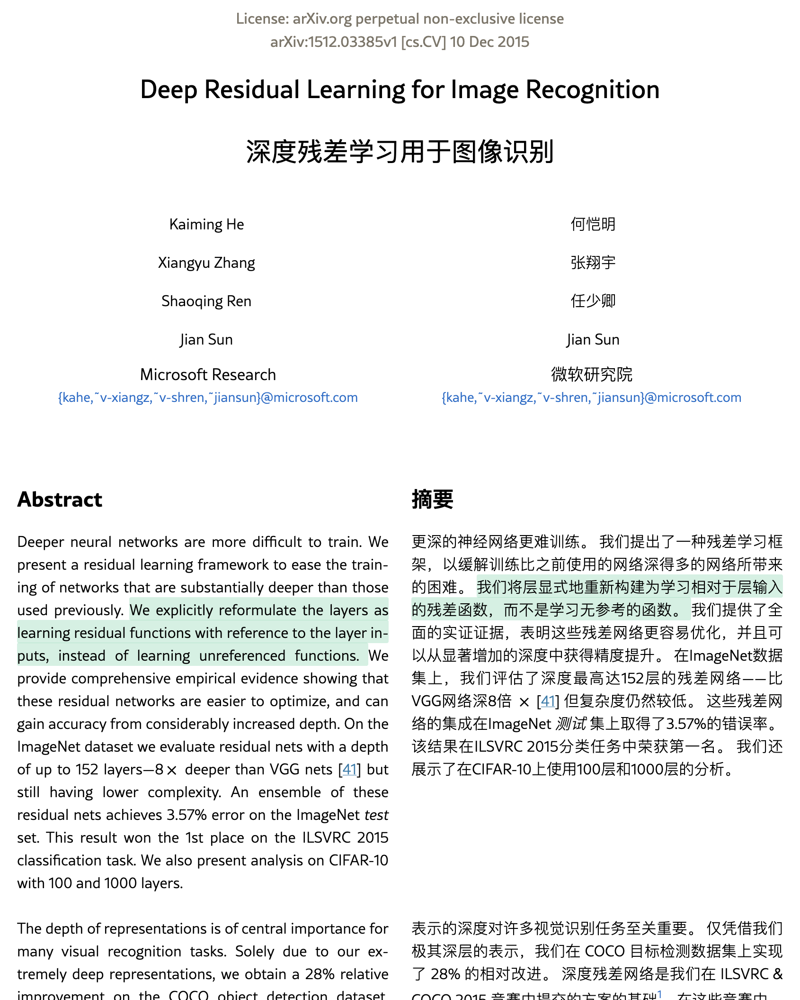
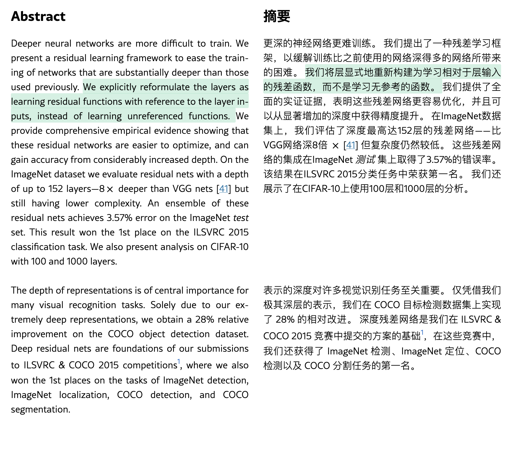
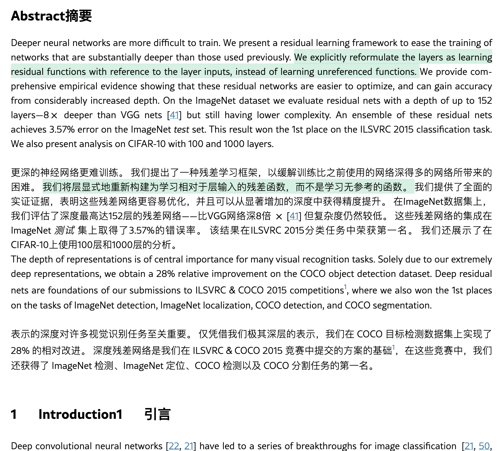
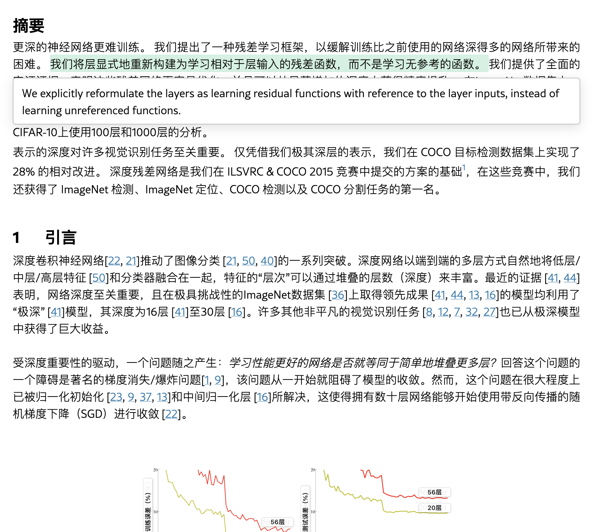
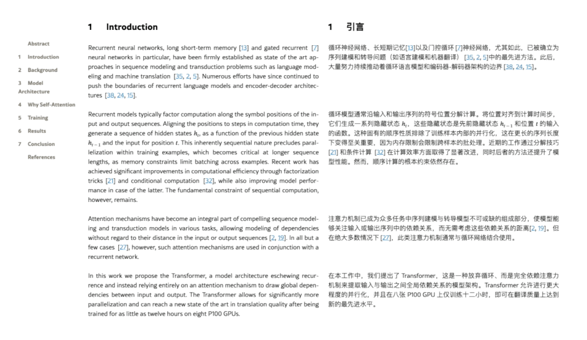
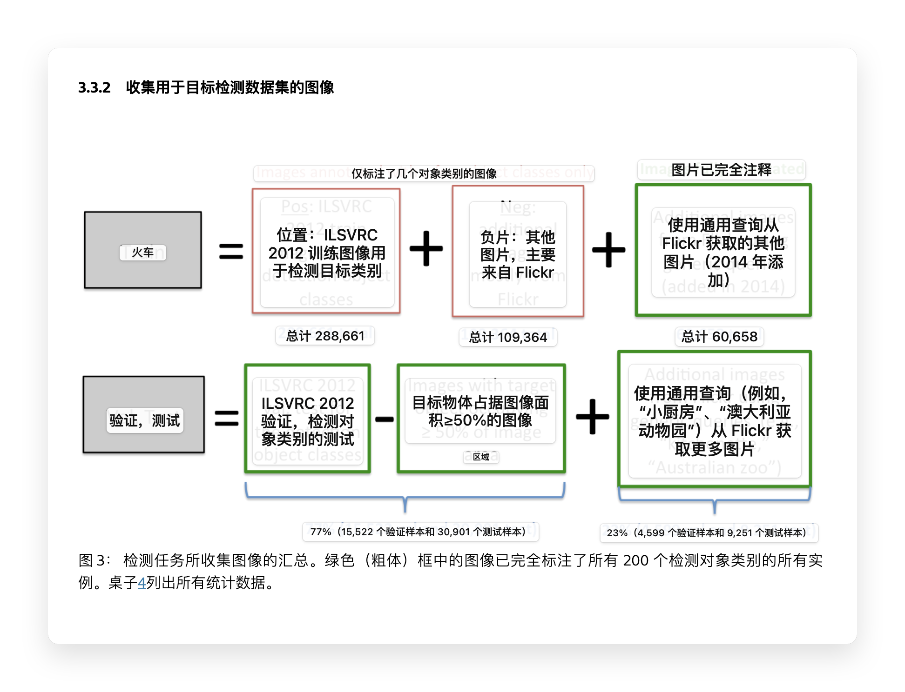
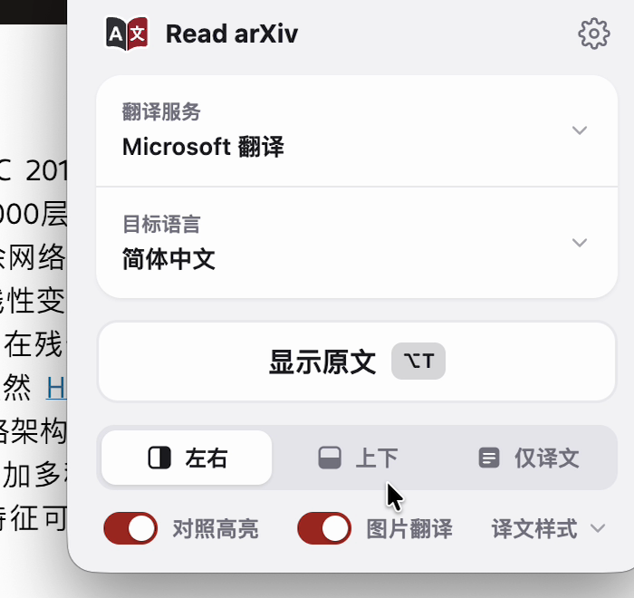
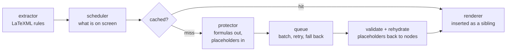

<div align="center">


# Read arXiv

**Bilingual arXiv papers in Chrome.** The mathematics, the citations and the links pass through
untouched, and one click puts the page back exactly as it was.

[](LICENSE)
[](#install)
[](https://github.com/SRjoeee/ArxivTranslate/actions/workflows/ci.yml)

[简体中文](README.zh-CN.md)

</div>



arXiv's experimental HTML is generated by LaTeXML, which means every element on the page carries a
class that says what it is. Read arXiv uses that: instead of guessing at a page the way a
general-purpose translator has to, it works from a rule set written against LaTeXML's own markup —
so it knows a displayed equation from a caption, a bibliography entry from a footnote, and a table
of numbers from a table of prose.

## What it does differently

**It puts the page back.** A translation is only ever inserted as the next sibling of the block it
belongs to; no original node's subtree is ever modified. Restoring is therefore not an undo log —
it is a removal, after which the document is node-for-node identical to what arXiv served. Tests
hold that invariant on every fixture paper.

**The mathematics never reaches the engine.** Before a paragraph is sent, its formulas, citations,
code spans, footnote marks and links are lifted out and replaced by placeholders; afterwards the
original nodes are put back in their places. Nothing in the paper is re-rendered from a model's
output. If the placeholders come back damaged, the paragraph is retried once, then split at the
protected nodes and translated around them.

**Rules, not heuristics.** The selectors live in one versioned module and were audited against 30
papers: of 36,348 text-bearing nodes, exactly one fell outside the rules — an MSC classification
code, which should not be translated anyway.

**Nothing is translated before you see it.** Paragraphs are requested as they come into view, so
opening a 60-page paper costs one screen of translation, not sixty. Translations are cached
locally, so the second visit is instant.

## Reading

<table>
<tr>
<td width="33%"></td>
<td width="33%"></td>
<td width="33%"></td>
</tr>
<tr>
<td align="center"><b>Side by side</b><br>Two columns, figures and tables paired across both.</td>
<td align="center"><b>Stacked</b><br>The translation under each paragraph.</td>
<td align="center"><b>Translation</b><br>The original hidden; references stay bilingual.</td>
</tr>
</table>

Switching modes changes one attribute on `<html>`. Nothing is re-translated and nothing is
re-fetched.

**Hover to line the sentences up.** Rest on a sentence and the matching sentence lights up on the
other side — a band behind the whole line, so a sentence broken across inline formulas still reads
as one. The boundaries come from the translation service, never from guesswork; today only
Microsoft Translator reports them, so with the other services hovering does nothing.



**In translation-only mode, the original comes to you.** Rest on a sentence and its source appears
beside it — in the page's right margin where there is room, otherwise just below the line. It is
the original DOM, so the formulas and links inside it are intact.


**Figures are read too.** Text drawn inside an SVG figure is *read*, not recognised — LaTeXML
records which character each glyph draws, so there is no OCR error to make. For bitmap figures on
macOS, a small local helper runs Apple's Vision OCR and the translation is laid over the figure in
place; hover to see the original. Image translation is macOS-only for now.



**Appearance is yours.** Translation styles and highlight colours are editable lists, not a fixed
menu — colour, underline, weight, and a blur-until-hovered style for testing yourself. Changes
apply at once; there is no save button.

## Translation services

| Service | API key | Notes |
| --- | --- | --- |
| Microsoft Translator | not needed | The default. The only one that reports sentence boundaries, so hover alignment works here. |
| Google Translate | not needed | |
| Chrome's built-in translation | not needed | Runs on your machine, offline, once Chrome has downloaded the language pack. |
| Any OpenAI-compatible endpoint | yours | OpenRouter, DeepSeek, Ollama, LM Studio and the like. Prompts and the glossary apply here. |

Add as many endpoints as you like in the settings; each is saved with its own key and model. When
the chosen service fails mid-paper — an expired key, a spent quota, a dropped connection — the rest
of the page falls back to a free one rather than stopping, and the popup says what happened.

Prompts ship with the extension and can be copied and edited, and a glossary keeps a term reading
the same throughout a paper. Both apply only to the LLM services. The target language list covers
179 languages; where a service does not support your choice, the popup says so before you start.

## Install

Not on the Chrome Web Store yet. Build it and load it unpacked:

```sh
pnpm install
pnpm build
```

Open `chrome://extensions`, turn on **Developer mode**, choose **Load unpacked**, and select
`.output/chrome-mv3`. Chrome 131 or newer.

Open a paper at `arxiv.org/html/…` and press <kbd>Alt</kbd>+<kbd>T</kbd>, or use the toolbar button,
the right-click menu, or the popup. On an abstract page a **Bilingual version** link appears beside
arXiv's own HTML link, which opens the paper and starts translating in one step.



### Image translation (macOS)

Bitmap figures need a small local helper that calls Apple's Vision framework. The popup has a
one-command installer under **Images**; it needs Xcode Command Line Tools and takes about a minute
to build. The recognition happens on your machine and the figure is never uploaded; the words it
finds are then translated like any other text on the page. See
[`helper/README.md`](helper/README.md).

## How it works



The rules that decide what is a translatable block live in one module and nowhere else. The
placeholder engine, the three render modes and the restore path are the parts written from scratch
for this project; the request queue, the retry policy, the cache and the language tables are ported
from the projects credited below.

[`docs/DESIGN.md`](docs/DESIGN.md) is the source of truth — the DOM invariants are §7.1, the
placeholder protocol §6, the service interface §8, and image translation §15.
[`docs/RESEARCH.md`](docs/RESEARCH.md) holds the measurements the design rests on.

## Status

Pre-release, and in active development. Translating, the three modes, restoring, caching, the four
services, hover alignment, image translation and the settings all work today; the roadmap to a 1.0
and a web reader is [issue #155](https://github.com/SRjoeee/ArxivTranslate/issues/155).

Out of scope for now: other paper sites, PDFs, Firefox and Safari, and image translation anywhere
but macOS.

## Development

```sh
pnpm dev                 # WXT dev build, loads into Chrome
pnpm test                # Vitest, happy-dom
pnpm lint                # Biome
pnpm build

pnpm e2e                 # real Chromium with the extension loaded
pnpm e2e:layout          # side-mode layout contracts
pnpm e2e:a11y            # A/B axe audit: only what the extension introduces
pnpm e2e:placeholders    # placeholder survival through the real services
pnpm fixtures:stats      # rule coverage across the fixture papers
```

More than 1,500 unit tests across 108 files, plus six end-to-end suites that drive a real browser.

Twelve real arXiv papers are committed as fixtures, chosen between them to cover dense inline
mathematics, theorem and proof environments, algorithm and code blocks, tables of 1,899 cells,
footnote-heavy and citation-heavy papers, SVG figures, LaTeXML output from 2023 through 2026, and
two pages carrying `.ltx_ERROR` — one of them a failed conversion with a single paragraph and no
title, which the extension has to survive rather than translate. A thirteenth fixture is synthetic:
LaTeXML emits 145 structures that none of the sampled papers happened to use, and that file writes
one of each so an unseen structure cannot go silently untranslated.

The invariant tests are the ones to keep green: restore must leave the DOM node-for-node identical,
every text node must fall under exactly one rule, and every placeholder must survive the round trip.

Contributions are welcome. Read [`CLAUDE.md`](CLAUDE.md) first — it records the constraints this
codebase is built under, and a change that violates one of them will not be right no matter how well
it is written.

## Built on

Read arXiv ports code from three GPL-3.0 translation extensions, and is grateful to all three:

- [KISS Translator](https://github.com/fishjar/kiss-translator) — translation styles, and the
  approach to rich-text placeholders
- [Read Frog](https://github.com/mengxi-ream/read-frog) — the request queue, batching, retry policy,
  viewport scheduling, the prompt library and the language tables
- [FluentRead](https://github.com/Bistutu/FluentRead) — the Dexie cache

The OCR helper is ported from [macos-vision-ocr](https://github.com/bytefer/macos-vision-ocr) (MIT),
and the figure-overlay rendering follows
[ImageTrans](https://github.com/xulihang/ImageTrans_chrome_extension). Every ported file names its
source in its header; [`docs/THIRD_PARTY.md`](docs/THIRD_PARTY.md) is the register.

## License

[GPL-3.0](LICENSE), the same licence as the projects it is built on.
