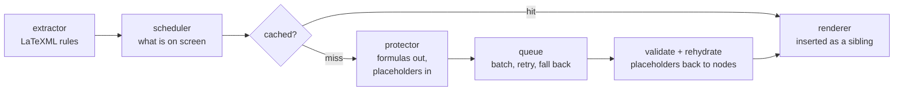

<div align="center">


# Read arXiv

**Read arXiv in your language.** The translation sits beside the paper rather than in place of it,
and the equations, the figures and the layout stay exactly as the author set them.

[](LICENSE)
[](#start-reading)
[](https://github.com/SRjoeee/ArxivTranslate/actions/workflows/ci.yml)

[简体中文](README.zh-CN.md)

</div>


Read arXiv puts a translation beside a paper instead of in place of it. Follow the argument in your
own language, check a line against the author's own words, and go back to the original whenever you
want — without leaving the page.

## Read the paper, not just the translation

**The original never goes away.** Read the two columns side by side, stack the translation under
each paragraph, or hide the original entirely, and change your mind as often as you like. *Show the
original* returns the page to exactly what arXiv served.

**The paper keeps its shape.** Headings, figures, tables, numbered equations, footnotes and the
reference list stay where the author put them. The translation is added around them rather than
over them, so what you are reading is still the paper's own layout.

**The mathematics is the author's, not a copy of it.** Equations, citations, code and links are set
aside before a paragraph is translated and put back afterwards, unchanged. A formula you stop to
check is the one arXiv rendered.

**The words inside figures are translated too.** Labels and axes in a paper's diagrams are as much
of the argument as the prose around them.

**Only what you are reading is translated.** Paragraphs are translated as you reach them, and kept
afterwards, so coming back to a paper costs nothing and picks up where you left off.

Machine translation misreads terminology and will occasionally change a claim. Keeping the original
beside you is not a nicety — it is how you catch that. Protecting the structure of a page does not
make the words on it correct.

## Choose how it reads

<table>
<tr>
<td width="33%"></td>
<td width="33%"></td>
<td width="33%"></td>
</tr>
<tr>
<td align="center"><b>Side by side</b><br>Two columns, figures and tables paired across both.</td>
<td align="center"><b>Stacked</b><br>The translation under each paragraph.</td>
<td align="center"><b>Translation</b><br>The original hidden; references stay bilingual.</td>
</tr>
</table>

Switching is instant, and nothing is translated a second time.

**Hover to line the sentences up.** Rest on a sentence and the matching one lights up on the other
side, a band behind the whole line, so a sentence broken across inline formulas still reads as one.
The pairing comes from the translation service rather than from guesswork, which is why it is
available with Microsoft Translator and not yet with the others.


**In translation-only mode, the original comes to you.** Rest on a sentence and its source appears
beside it — in the page's right margin where there is room, otherwise just below the line. It is
the passage itself, so the formulas and links inside it are live.


**Figures are translated in place.** In a vector figure the characters are already in the file, so
its labels are translated from the paper's own text rather than guessed from pixels. Bitmap figures
are read by a small helper on your own machine, currently macOS only, and the translation is laid
over the figure where the original words were; hover to see them again.


**Appearance is yours.** Translation styles and highlight colours are editable lists, not a fixed
menu — colour, underline, weight, and a blur-until-hovered style for testing yourself. Changes
apply at once; there is no save button.

## Start reading

Not on the Chrome Web Store yet, so it is built from source. Desktop Chrome 131 or newer. arXiv's
HTML papers only — PDFs are not translated.

1. **Build it.**

   ```sh
   pnpm install
   pnpm build
   ```

2. **Load it.** Open `chrome://extensions`, turn on **Developer mode**, choose **Load unpacked**,
   and select `.output/chrome-mv3`.

3. **Open a paper** at `arxiv.org/html/…` and press <kbd>Alt</kbd>+<kbd>T</kbd> — or use the toolbar
   button, the right-click menu, or the popup. On an abstract page a **Bilingual version** link
   appears beside arXiv's own HTML link, which opens the paper and starts translating in one step.

There is nothing to set up first: the default service needs no account and no key. Choose your
language in the popup, and change the service there whenever you want.


### Translating figures (macOS)

Words inside bitmap figures are read by a small helper that runs on your own machine. The popup has
a one-command installer under **Images**; it needs Xcode Command Line Tools and takes about a minute
to build. See [`helper/README.md`](helper/README.md).

## Translation services

| Service | API key | Notes |
| --- | --- | --- |
| Microsoft Translator | not needed | The default. The only one that reports sentence boundaries, so hover alignment works here. |
| Google Translate | not needed | |
| Chrome's built-in translation | not needed | Runs on your machine, offline, once Chrome has downloaded the language pack. |
| Any OpenAI-compatible endpoint | yours | OpenRouter, DeepSeek, Ollama, LM Studio and the like. Prompts and the glossary apply here. |

Add as many endpoints as you like in the settings; each is saved with its own key and model. When
the chosen service fails mid-paper — an expired key, a spent quota, a dropped connection — the rest
of the page falls back to a free one rather than stopping, and the popup says what happened.

Prompts ship with the extension and can be copied and edited, and a glossary keeps a term reading
the same throughout a paper. Both apply only to the LLM services. The target language list covers
179 languages; where a service does not support your choice, the popup says so before you start.

## Where the text goes

Paragraphs are sent to whichever service is selected, so the paper's text reaches Microsoft's or
Google's endpoint, or the endpoint you configured yourself. Two arrangements keep the text on your
machine: Chrome's built-in translation, and a local LLM such as Ollama or LM Studio.

Falling back to a free service when the chosen one fails is on by default, which means a failure can
send the rest of a paper somewhere you did not pick. Turn it off in the settings to stay with one
service. Your API keys are held in the browser's extension storage and are never written to logs or
to the translation cache; saved translations stay on your machine. A figure is read locally and the
image itself is never uploaded, but the words found in it are then translated like any other text.

## How it works

arXiv's HTML is generated by LaTeXML, so every element on the page is labelled with what it is. Read
arXiv works from those labels instead of guessing at the page, which is how it tells a displayed
equation from a caption, a bibliography entry from a footnote, or a table of numbers from a table of
prose. The labels are read in one place, and the rules built on them are versioned with the cache,
so a change to them does not leave stale translations behind.



The rules that decide what is a translatable block live in one module and nowhere else. The
placeholder engine, the three render modes and the restore path are the parts written from scratch
for this project; the request queue, the retry policy, the cache and the language tables are ported
from the projects credited below.

[`docs/DESIGN.md`](docs/DESIGN.md) is the source of truth — the DOM invariants are §7.1, the
placeholder protocol §6, the service interface §8, and image translation §15.
[`docs/RESEARCH.md`](docs/RESEARCH.md) holds the measurements the design rests on.

## Status

Pre-release, and in active development. Translating, the three modes, restoring, caching, the four
services, hover alignment, image translation and the settings all work today; the roadmap to a 1.0
and a web reader is [issue #155](https://github.com/SRjoeee/ArxivTranslate/issues/155).

Out of scope for now: other paper sites, PDFs, Firefox and Safari, and image translation anywhere
but macOS.

## Development

```sh
pnpm dev                 # WXT dev build, loads into Chrome
pnpm test                # Vitest, happy-dom
pnpm lint                # Biome
pnpm build

pnpm e2e                 # real Chromium with the extension loaded
pnpm e2e:layout          # side-mode layout contracts
pnpm e2e:a11y            # A/B axe audit: only what the extension introduces
pnpm e2e:placeholders    # placeholder survival through the real services
pnpm fixtures:stats      # rule coverage across the fixture papers
```

The unit tests run on happy-dom; the end-to-end suites drive a real browser with the extension
loaded. Real arXiv papers are committed as fixtures and are what the rules and the renderer are
tested against, chosen between them to cover dense inline mathematics, theorem environments,
algorithm and code blocks, large tables, footnotes, SVG figures, LaTeXML output from 2023 onwards,
and pages where arXiv's own conversion failed and the extension has to survive rather than
translate. One further fixture is synthetic, holding the structures LaTeXML can emit that none of
the sampled papers happened to use.

Three invariants are the ones to keep green: restoring must leave the document node-for-node
identical, every text node must fall under exactly one rule, and every placeholder must survive the
round trip.

Contributions are welcome. Read [`CLAUDE.md`](CLAUDE.md) first — it records the constraints this
codebase is built under, and a change that violates one of them will not be right no matter how well
it is written.

## Built on

Read arXiv ports code from three GPL-3.0 translation extensions, and is grateful to all three:

- [KISS Translator](https://github.com/fishjar/kiss-translator) — translation styles, and the
  approach to rich-text placeholders
- [Read Frog](https://github.com/mengxi-ream/read-frog) — the request queue, batching, retry policy,
  viewport scheduling, the prompt library and the language tables
- [FluentRead](https://github.com/Bistutu/FluentRead) — the Dexie cache

The OCR helper is ported from [macos-vision-ocr](https://github.com/bytefer/macos-vision-ocr) (MIT),
and the figure-overlay rendering follows
[ImageTrans](https://github.com/xulihang/ImageTrans_chrome_extension). Every ported file names its
source in its header; [`docs/THIRD_PARTY.md`](docs/THIRD_PARTY.md) is the register.

## License

[GPL-3.0](LICENSE), the same licence as the projects it is built on.

---

Read arXiv is an independent project. It is not affiliated with, or endorsed by, arXiv or Cornell
University.
