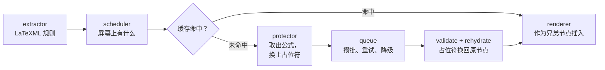

<div align="center">


# Read arXiv

**在 Chrome 里读双语 arXiv 论文。** 公式、引用与链接原样穿过翻译，随时一键让页面回到原样。

[](LICENSE)
[](#安装)
[](https://github.com/SRjoeee/ArxivTranslate/actions/workflows/ci.yml)

[English](README.md)

</div>


arXiv 的实验性 HTML 由 LaTeXML 生成，页面上每个元素都带类名，说明自己是什么。Read arXiv 用的正是这一点：
通用翻译器只能靠启发式猜测页面结构，而它按 LaTeXML 自己的标记写规则——因此分得清行间公式与图注、
参考文献条目与脚注、数值表与文字表。

## 与别的翻译扩展有何不同

**它能把页面放回去。** 译文只作为所属块的下一个兄弟节点插入，原节点的子树一律不动。因此「显示原文」不是撤销日志，
而是一次删除；删完之后，文档与 arXiv 发来的那一份逐节点相等。每篇 fixture 上都有测试守着这条不变量。

**公式根本不会送到引擎。** 段落发出之前，其中的公式、引用、代码、脚注标记与链接会被取出、换成占位符；
回来之后再把原节点放回原位。论文里没有任何东西是由模型的输出重新渲染的。占位符若被破坏，该段重试一次，
再不行就在受保护节点处切段，绕开它们翻译。

**靠规则，不靠启发式。** 选择器集中在一个带版本号的模块里，并已用 30 篇论文审计：36348 个带文字的节点中，
只有一个落在规则之外——数学论文的 MSC 分类号，本来也不该翻译。

**没看到的地方不翻。** 段落进入视口才发请求，因此打开一篇 60 页的论文只花一屏的翻译量，而不是六十屏。
译文存在本地，再次打开即时出现。

## 阅读

<table>
<tr>
<td width="33%"></td>
<td width="33%"></td>
<td width="33%"></td>
</tr>
<tr>
<td align="center"><b>左右对照</b><br>分两栏，图与表在两栏之间配对。</td>
<td align="center"><b>上下对照</b><br>译文落在每段原文之下。</td>
<td align="center"><b>仅译文</b><br>隐藏原文，参考文献仍保持双语。</td>
</tr>
</table>

切换模式只改 `<html>` 上的一个属性，不重新翻译，也不重新请求。

**悬停即可对上句子。** 鼠标停在一句上，另一侧对应的那句同时出现底色——底色是一整行的平底，
所以被行内公式打断的句子读起来仍是一条。句边界由翻译服务给出，绝不靠猜；目前只有微软翻译会报，
用其他服务时悬停没有反应。


**仅译文模式下，原文会自己过来。** 停在一句译文上，它的原文就出现在旁边——页边距放得下就放在页边距，
否则贴在这一行下方。面板里是原文的 DOM，所以其中的公式与链接都是活的。


**图里的字也翻。** SVG 图里的文字是**读**出来的，不是识别出来的——LaTeXML 记下了每个字形画的是哪个字符，
因此不存在识别误差。位图图片在 macOS 上由一个本机小程序调用 Apple Vision 识别，译文叠在原图上，
悬停可看原文。图片翻译目前仅支持 macOS。


**外观由你定。** 译文样式与高亮配色是可增删改的列表，不是固定菜单——颜色、下划线、字重，
以及一种「悬停前模糊」的样式，用来自测理解。改动即时生效，没有保存按钮。

## 翻译服务

| 服务 | API Key | 说明 |
| --- | --- | --- |
| 微软翻译 | 不需要 | 默认。唯一会报句边界的服务，悬停对照只在它下面可用。 |
| Google 翻译 | 不需要 | |
| Chrome 内置翻译 | 不需要 | 在本机运行，语言包下载后可离线使用。 |
| 任意 OpenAI 兼容接口 | 你自己的 | OpenRouter、DeepSeek、Ollama、LM Studio 等。提示词与术语表只对这类服务生效。 |

服务可以加任意多个，各自保存自己的 Key 与模型。选定的服务在翻译途中失效时——Key 过期、额度用尽、连接中断——
页面剩下的部分会改用免费服务继续，而不是停下，popup 会说明发生了什么。

扩展自带提示词，可复制后编辑；术语表让同一个术语在整篇论文里译法一致。两者只对 AI 模型生效。
目标语言表覆盖 179 种语言；所选服务不支持某种语言时，popup 会在开始之前就告诉你。

## 安装

尚未上架 Chrome 应用商店。自行构建并以开发者模式加载：

```sh
pnpm install
pnpm build
```

打开 `chrome://extensions`，开启**开发者模式**，点**加载已解压的扩展程序**，选择 `.output/chrome-mv3`。
需要 Chrome 131 或更新版本。

打开 `arxiv.org/html/…` 的论文，按 <kbd>Alt</kbd>+<kbd>T</kbd>，或用工具栏按钮、右键菜单、popup 都可以。
摘要页上，arXiv 自己的 HTML 链接旁会多一条**双语版**入口，点它即可打开论文并直接开始翻译。


### 图片翻译（macOS）

位图图片需要一个调用 Apple Vision 的本机小程序。popup 的「图片翻译」下有一条一键安装命令；
它需要 Xcode Command Line Tools，编译约一分钟。识别在本机完成，图片本身不会上传；认出来的文字
随后与页面上其他文字一样送去翻译。详见 [`helper/README.md`](helper/README.md)。

## 它怎么工作



「什么算一个可翻译块」的规则只写在一个模块里，别处没有。占位符引擎、三种渲染模式与恢复路径是本项目原创的部分；
请求队列、重试策略、缓存与语言表移植自下面致谢的项目。

[`docs/DESIGN.md`](docs/DESIGN.md) 是唯一事实来源——DOM 不变量见 §7.1，占位符协议见 §6，服务接口见 §8，
图片翻译见 §15。[`docs/RESEARCH.md`](docs/RESEARCH.md) 记录着设计所依据的实测数据。

## 状态

尚未发布，仍在活跃开发中。翻译、三种模式、恢复原文、缓存、四种服务、悬停对照、图片翻译与设置页今天都可用；
通往 1.0 与网页版阅读器的路线图见 [issue #155](https://github.com/SRjoeee/ArxivTranslate/issues/155)。

暂不考虑：其他论文站点、PDF、Firefox 与 Safari、以及 macOS 以外平台的图片翻译。

## 开发

```sh
pnpm dev                 # WXT 开发构建，自动加载到 Chrome
pnpm test                # Vitest + happy-dom
pnpm lint                # Biome
pnpm build

pnpm e2e                 # 真实 Chromium 加载扩展跑
pnpm e2e:layout          # 左右对照模式的版式契约
pnpm e2e:a11y            # A/B 无障碍审计，只报由扩展引入的差集
pnpm e2e:placeholders    # 占位符在真实服务上的存活率
pnpm fixtures:stats      # fixture 上的规则覆盖率
```

1500 多个单元测试分布在 108 个文件里，另有六套驱动真实浏览器的端到端测试。

仓库里存了 12 篇真实 arXiv 论文作为 fixture，合起来覆盖行内公式密集、定理与证明、算法框与代码块、
1899 格的大表、脚注密集与引用密集、SVG 图、2023 至 2026 年的 LaTeXML 输出，以及两篇含 `.ltx_ERROR` 的页面——
其中一篇是转换失败页，只有一个段落、没有标题，扩展要做的是不挂掉而不是翻译它。
第 13 份 fixture 是合成的：LaTeXML 会输出 145 种结构在抽样论文里一次都没出现过，那份文件为每种写了一份，
保证没见过的结构不会被悄悄漏翻。

最该保持绿色的是那几条不变量测试：恢复后 DOM 必须逐节点相等、每个文本节点必须恰好落在一条规则下、
每个占位符必须完整地走完一个来回。

欢迎贡献代码。请先读 [`CLAUDE.md`](CLAUDE.md)——它记录着这份代码所遵守的约束，
违反其中任何一条的改动，写得再好也不会是对的。

## 站在谁的肩膀上

Read arXiv 移植了三个 GPL-3.0 翻译扩展的代码，在此一并致谢：

- [KISS Translator](https://github.com/fishjar/kiss-translator)——译文样式，以及富文本占位符的思路
- [Read Frog](https://github.com/mengxi-ream/read-frog)——请求队列、攒批、重试策略、视口调度、提示词库与语言表
- [FluentRead](https://github.com/Bistutu/FluentRead)——基于 Dexie 的缓存

OCR 小程序移植自 [macos-vision-ocr](https://github.com/bytefer/macos-vision-ocr)（MIT），
图上叠加层的渲染参考了 [ImageTrans](https://github.com/xulihang/ImageTrans_chrome_extension)。
每个移植文件的文件头都写明了来源，[`docs/THIRD_PARTY.md`](docs/THIRD_PARTY.md) 是总登记表。

## 许可证

[GPL-3.0](LICENSE)，与它所移植的项目相同。
