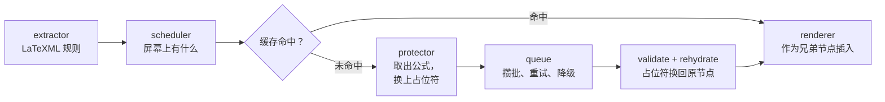

<div align="center">


# Read arXiv

**用你熟悉的语言读 arXiv。** 译文放在论文旁边，而不是取代它；公式、图表与版式都保持作者原来的样子。

[](LICENSE)
[](#开始阅读)
[](https://github.com/SRjoeee/ArxivTranslate/actions/workflows/ci.yml)

[English](README.md)

</div>


Read arXiv 把译文放在论文旁边，而不是放在论文的位置上。用熟悉的语言跟上论证，回头核对作者的原话，
随时切回原文——都不必离开当前页面。

## 读的是论文，不只是一份译文

**原文始终在身边。** 左右两栏并排读、把译文叠在每段原文之下、或者干脆把原文藏起来，
随时可以改主意。点「显示原文」，页面就回到 arXiv 交给你的那个样子。

**论文保有原来的形状。** 标题、插图、表格、带编号的公式、脚注与参考文献都留在作者放的位置。
译文是加在它们周围的，不是盖在上面，所以你读的仍然是这篇论文自己的版式。

**公式是作者的那一个，不是它的副本。** 段落送去翻译之前，公式、引用、代码与链接会被取出来，
翻完再原样放回。你停下来核对的那个公式，就是 arXiv 渲染出来的那一个。

**图里的字也会翻。** 图中的标注与坐标轴，和它周围的正文一样，都是论证的一部分。

**只翻你正在读的部分。** 段落读到哪里翻到哪里，翻过的留着，所以再打开这篇论文不花任何代价，
而且接着上次的位置继续。

机器翻译会认错术语，偶尔也会改变一句话的意思。把原文留在身边不是锦上添花，而是你发现这些问题的方式。
保住页面的结构，并不等于保证上面的文字是对的。

## 选一种读法

<table>
<tr>
<td width="33%"></td>
<td width="33%"></td>
<td width="33%"></td>
</tr>
<tr>
<td align="center"><b>左右对照</b><br>分两栏，图与表在两栏之间配对。</td>
<td align="center"><b>上下对照</b><br>译文落在每段原文之下。</td>
<td align="center"><b>仅译文</b><br>隐藏原文，参考文献仍保持双语。</td>
</tr>
</table>

切换是即时的，不会重翻第二遍。

**悬停即可对上句子。** 鼠标停在一句上，另一侧对应的那句同时亮起——底色是一整行的平底，
所以被行内公式打断的句子读起来仍是一条。配对由翻译服务给出，不靠猜，
因此目前在微软翻译下可用，其他服务还不行。


**仅译文模式下，原文会自己过来。** 停在一句译文上，它的原文就出现在旁边——页边距放得下就放在页边距，
否则贴在这一行下方。出现的就是那段原文本身，里面的公式与链接都是活的。


**图里的文字就地翻译。** 矢量图里的字符本来就在文件里，所以图中的标注是照论文自己的文字翻的，
不靠从像素里猜。位图图片由一个跑在你自己机器上的小程序读出文字（目前仅 macOS），
译文盖在原本写着那些字的位置上；把鼠标移上去就能看回原文。


**外观由你定。** 译文样式与高亮配色是可增删改的列表，不是固定菜单——颜色、下划线、字重，
以及一种「悬停前模糊」的样式，用来自测理解。改动即时生效，没有保存按钮。

## 开始阅读

尚未上架 Chrome 应用商店，因此需要从源码构建。桌面版 Chrome 131 或更新版本。只翻 arXiv 的 HTML 论文，不翻 PDF。

1. **构建。**

   ```sh
   pnpm install
   pnpm build
   ```

2. **加载。** 打开 `chrome://extensions`，开启**开发者模式**，点**加载已解压的扩展程序**，
   选择 `.output/chrome-mv3`。

3. **打开一篇论文**，地址形如 `arxiv.org/html/…`，按 <kbd>Alt</kbd>+<kbd>T</kbd>——
   也可以用工具栏按钮、右键菜单或 popup。摘要页上，arXiv 自己的 HTML 链接旁会多一条**双语版**入口，
   点它即可打开论文并直接开始翻译。

不需要先配置什么：默认的翻译服务不用注册、也不用填 Key。在 popup 里选好语言，服务随时可以换。


### 翻译图片（macOS）

位图图片里的文字，由一个跑在你自己机器上的小程序读出来。popup 的「图片翻译」下有一条一键安装命令；
它需要 Xcode Command Line Tools，编译约一分钟。详见 [`helper/README.md`](helper/README.md)。

## 翻译服务

| 服务 | API Key | 说明 |
| --- | --- | --- |
| 微软翻译 | 不需要 | 默认。唯一会报句边界的服务，悬停对照只在它下面可用。 |
| Google 翻译 | 不需要 | |
| Chrome 内置翻译 | 不需要 | 在本机运行，语言包下载后可离线使用。 |
| 任意 OpenAI 兼容接口 | 你自己的 | OpenRouter、DeepSeek、Ollama、LM Studio 等。提示词与术语表只对这类服务生效。 |

服务可以加任意多个，各自保存自己的 Key 与模型。选定的服务在翻译途中失效时——Key 过期、额度用尽、连接中断——
页面剩下的部分会改用免费服务继续，而不是停下，popup 会说明发生了什么。

扩展自带提示词，可复制后编辑；术语表让同一个术语在整篇论文里译法一致。两者只对 AI 模型生效。
目标语言表覆盖 179 种语言；所选服务不支持某种语言时，popup 会在开始之前就告诉你。

## 文字送到哪里去

段落会发给当前选中的服务，因此论文的文字会到达微软或 Google 的端点，或者你自己填的那个端点。
有两种组合能让文字不离开你的机器：Chrome 内置翻译，以及 Ollama、LM Studio 这类本机运行的模型。

选中的服务出问题时自动改用免费服务，这个开关默认是开的——也就是说一次失败可能把论文剩下的部分
送去你没有选的地方。想始终只用一个服务，就到设置里关掉它。你的 API Key 存在浏览器的扩展存储里，
从不写进日志，也不进翻译缓存；翻过的译文留在本机。图片是在本机读的，图片本身不会上传，
但从中认出来的文字随后与页面上其他文字一样送去翻译。

## 它怎么工作

arXiv 的 HTML 由 LaTeXML 生成，页面上每个元素都标注了自己是什么。Read arXiv 依据这些标注工作，
而不是去猜测页面结构——因此它分得清行间公式与图注、参考文献条目与脚注、数值表与文字表。
这些标注只在一处读取，基于它们的规则带版本号并参与缓存键，所以改了规则不会留下过期的译文。



「什么算一个可翻译块」的规则只写在一个模块里，别处没有。占位符引擎、三种渲染模式与恢复路径是本项目原创的部分；
请求队列、重试策略、缓存与语言表移植自下面致谢的项目。

[`docs/DESIGN.md`](docs/DESIGN.md) 是唯一事实来源——DOM 不变量见 §7.1，占位符协议见 §6，服务接口见 §8，
图片翻译见 §15。[`docs/RESEARCH.md`](docs/RESEARCH.md) 记录着设计所依据的实测数据。

## 状态

尚未发布，仍在活跃开发中。翻译、三种模式、恢复原文、缓存、四种服务、悬停对照、图片翻译与设置页今天都可用；
通往 1.0 与网页版阅读器的路线图见 [issue #155](https://github.com/SRjoeee/ArxivTranslate/issues/155)。

暂不考虑：其他论文站点、PDF、Firefox 与 Safari、以及 macOS 以外平台的图片翻译。

## 开发

```sh
pnpm dev                 # WXT 开发构建，自动加载到 Chrome
pnpm test                # Vitest + happy-dom
pnpm lint                # Biome
pnpm build

pnpm e2e                 # 真实 Chromium 加载扩展跑
pnpm e2e:layout          # 左右对照模式的版式契约
pnpm e2e:a11y            # A/B 无障碍审计，只报由扩展引入的差集
pnpm e2e:placeholders    # 占位符在真实服务上的存活率
pnpm fixtures:stats      # fixture 上的规则覆盖率
```

单元测试跑在 happy-dom 上；端到端测试驱动真实浏览器并加载扩展。仓库里存了若干篇真实 arXiv 论文作为
fixture，规则与渲染都以它们为准，合起来覆盖行内公式密集、定理环境、算法框与代码块、大表格、脚注、
SVG 图、2023 年以来的 LaTeXML 输出，以及 arXiv 自己转换失败的页面——那种页面扩展要做的是不挂掉，
而不是翻译它。另有一份合成 fixture，收着 LaTeXML 会输出但抽样论文里一次都没出现过的那些结构。

最该保持绿色的是三条不变量：恢复后文档必须逐节点相等、每个文本节点必须恰好落在一条规则下、
每个占位符必须完整地走完一个来回。

欢迎贡献代码。请先读 [`CLAUDE.md`](CLAUDE.md)——它记录着这份代码所遵守的约束，
违反其中任何一条的改动，写得再好也不会是对的。

## 站在谁的肩膀上

Read arXiv 移植了三个 GPL-3.0 翻译扩展的代码，在此一并致谢：

- [KISS Translator](https://github.com/fishjar/kiss-translator)——译文样式，以及富文本占位符的思路
- [Read Frog](https://github.com/mengxi-ream/read-frog)——请求队列、攒批、重试策略、视口调度、提示词库与语言表
- [FluentRead](https://github.com/Bistutu/FluentRead)——基于 Dexie 的缓存

OCR 小程序移植自 [macos-vision-ocr](https://github.com/bytefer/macos-vision-ocr)（MIT），
图上叠加层的渲染参考了 [ImageTrans](https://github.com/xulihang/ImageTrans_chrome_extension)。
每个移植文件的文件头都写明了来源，[`docs/THIRD_PARTY.md`](docs/THIRD_PARTY.md) 是总登记表。

## 许可证

[GPL-3.0](LICENSE)，与它所移植的项目相同。

---

Read arXiv 是一个独立项目，与 arXiv 及康奈尔大学没有隶属关系，也未获其背书。
